# 	NYC motor vehicle collision transparency

Author(s): Jason Jiang, Gabriel Fernandez and Jason Jiang
Fall 2022 (Updated: Sept. 2023)

## Project bites :chocolate_bar:

**Brief**: 

**Key insights**: 

**Tools**: 

**Concepts**:

## Team members contributions

In this team project, we initially collaborated closely on all aspects. However, during the later stages, we divided our responsibilities as follows:

- Gabriel handled ETL tasks and data preparation for the dashboard phase, while Jason reviewed his work.
- Jason concentrated on designing the Tableau dashboard, with Gabriel providing feedback on his work.
  
We split responsibilities to make the most of our strengths and get things done efficiently.

## Project objective :dart:
Following the Kimball Lifecycle to design and develop a public, cloud-based data warehouse with a functioning Business Intelligence (BI) applications.

## Project workflow: [Kimball Lifecycle](https://www.kimballgroup.com/data-warehouse-business-intelligence-resources/kimball-techniques/dw-bi-lifecycle-method/)

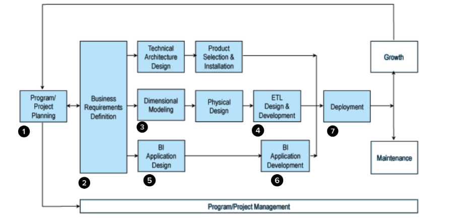

### 1. Project planning

#### Motivation for project:
A recent congestion pricing plan will charge drivers $23 to enter Manhattan if implemented. It was part of NYC’s strategy to tackle congestion and other problems relating to the city’s health ([source](https://www.nytimes.com/2022/08/18/nyregion/nyc-congestion-pricing-manhattan.html)). This sparked our group’s interest in taking a look into the traffic congestion statistics in NYC - specifically relating to traffic accidents. This is especially relevant now that the city is implementing more bike lanes and reducing carbon emissions. For example, in 2013, Citi Bike was launched as an alternative transportation method to help the environment and keep the city’s citizens healthy. 

We want to see how traffic collisions in NYC changed over the years and if additions similar to Citi Bike made traffic conditions better or worse for the city. Our group hopes to bring more transparency to traffic collisions in NYC.

#### Description of the issues or opportunities the project will address:
- What are collision statistics broken down by vehicle type? (Cars, bikes, motorcycles, buses, etc.)
    - Is there seasonality to this? 
    - Driver’s license status
- What are the areas in the city most prone to collisions? (Boroughs, Zip Codes, etc.)
- What time are collisions more likely to occur? (Rush hour, mornings, etc.)
- Which are contributing factors of collisions in NYC?
    - Person emotional status
    - Pre-crash action (right turns, merges, etc.)
- What are the demographics of those involved in collisions?
    - Gender
    - Age
    - Borough
 
#### Project business or organization Value

##### High-level business initiative

We want to discover where and when most motor vehicle accidents happen in NYC and which demographics are more affected. Our group ultimately wants to bring transparency to the traffic collisions in NYC.

##### BI sponsors and stakeholders (who will own this project?)
This project is by Baruch students working for the NYC Department of Transportation (NYC DOT).

##### What’s the Business Value?
By identifying the context of motor vehicle accidents, we can come up with suggestions to guide city leaders in preventing these types of accidents.

#### Datasets

#### Dataset 1: [Motor Vehicle Collisions - Crashes](https://data.cityofnewyork.us/Public-Safety/Motor-Vehicle-Collisions-Crashes/h9gi-nx95)

The Motor Vehicle Collisions crash table contains details on the crash event. Each row represents a crash event. The Motor Vehicle Collisions data tables contain information from all police reported motor vehicle collisions in NYC.

#### Dataset 2: [Motor Vehicle Collisions - Person](https://data.cityofnewyork.us/Public-Safety/Motor-Vehicle-Collisions-Person/f55k-p6yu)

The Motor Vehicle Collisions person table contains details for people involved in the crash. Each row represents a person (driver, occupant, pedestrian, bicyclist,..) involved in a crash. The data in this table goes back to April 2016 when crash reporting switched to an electronic system. 

#####  Is the data we have conformed, consistent, and current? (data quality)

| Attribute                   | Status | Rationale                                   |
|-----------------------------|--------|---------------------------------------------|
| Conformed                   | Yes    | Datasets have the same units and convention.|
| Consistent                  | Yes    | Datasets share a primary key for unique info.|
| Current                     | Yes    | The two datasets are up-to-date:   - Motor Vehicle Collisions Crashes (last updated September 22, 2022)    - Motor Vehicle Collisions - Person (last updated September 22, 2022) |

 
##### What technical skills will we need to complete this project?

- Requirements gathering
- Data modeling
- Dimensional modeling
- ETL creation
- BI application design and implementation
- Data warehouse engineering
- Standardized report development

##### Will we need any new types of technologies?

- Lucidchart (design, drawings, and modeling)
- Python, SQL, and Colab for ETL (Extract, Transform, Load)
- Google BigQuery (data warehousing)
- Tableau (business intelligence and dashboarding)

### 2. Business requirements definition: Develop Key Performance Indicators

#### Number of Collisions by Year

This KPI allows us to investigate what year collisions are more likely to occur and can help identify any seasonalities (patterns) that exist.

#### Number of Collisions by Hour

This KPI can show which time collisions are more likely to occur. The Metropolitan Transportation Authority can use this insight to increase public transportation during crash- prone hours to disincentivize driving. Also, the New York City Department of Transportation can use this KPI to evaluate the proposed congestion pricing initiative.

#### Number of Victims by Month

This KPI can help the audience easily digest when most collisions take place and allow experts to perhaps better plan city traffic during months of high collisions.

#### Number of Victims by Age

Public safety officials can create educational campaigns targeting the age and gender groups more likely to experience a collision. Influencers for each age group can persuade people to behave in ways that reduce traffic collisions.

#### Number of Collisions by Zip Code

The New York City Department of Transportation can prioritize the zip codes with higher collisions with initiatives to reduce and prevent collisions. Also, they can compare successful interventions in the boroughs with fewer collisions and allocate more funds to the more affected boroughs.

#### Number of Cyclist Collisions by Year

We want to see how the introduction of city bikes since 2013 affected overall cyclist collisions (injuries and death).

### 3. Dimensional modeling 

#### Kimball Bus Matrix:

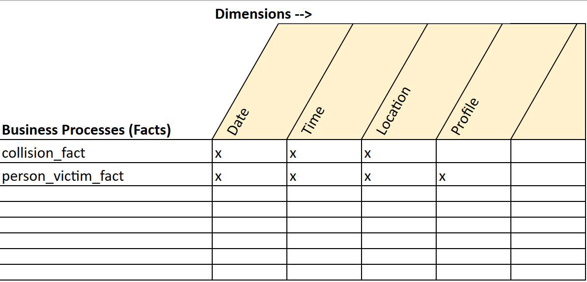

**The Kimball Bus Matrix** is a visual representation used in data warehousing to identify key business processes and their associated dimensions, aiding in the development of a dimensional data model. 

#### Dimensional model

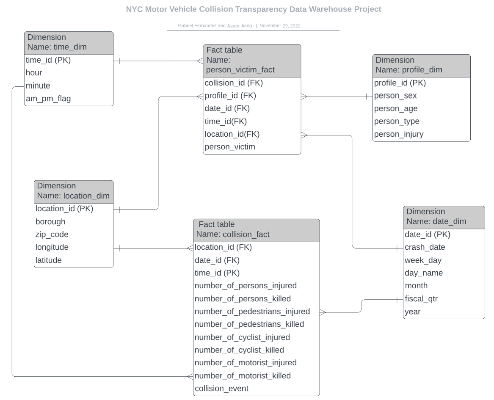

**Dimensional modeling** is a data modeling technique that structures data for efficient reporting and analysis, using fact tables for measures and dimension tables for descriptive attributes. This project's dimensional model consists of two facts tables and four dimensions.

### 4. ETL design and development

** ETL (Extract, Transform, Load)** refers to the process of extracting data from various sources, transforming it into a usable format, and then loading it into a data warehouse or database for analysis and reporting. We use Python and SQL to clean, prepare, and transform data extracted from NYC Open Data through the Socarata API, and then load it into our selected data warehouse (BigQuery). Finally, we connected Tableau with BigQuery to develop our business intelligence app (dashboards) for steps 6 and 7 of the Kimball Lifecycle .
For more details refer to: [ETL PDF Version](ETL_final_version.pdf)

### 5. BI application design

In application design, we created a wireframe to assist with dashboard planning and user interface development for our data warehouse.

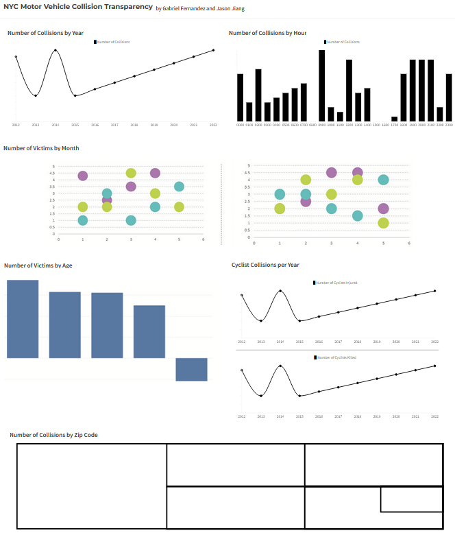

### 6. BI application development

In the BI application development stage, we employed Tableau to design and construct two dashboards for sharing our key performance indicators (KPIs).

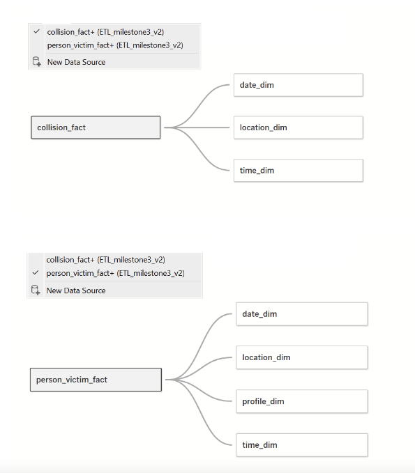

#### Visualizations for each KPI:

1. **Line chart** showing number of collisions by year allows us to see changes that occur over time. This allows us to investigate what year collisions are more likely to occur.

 
   
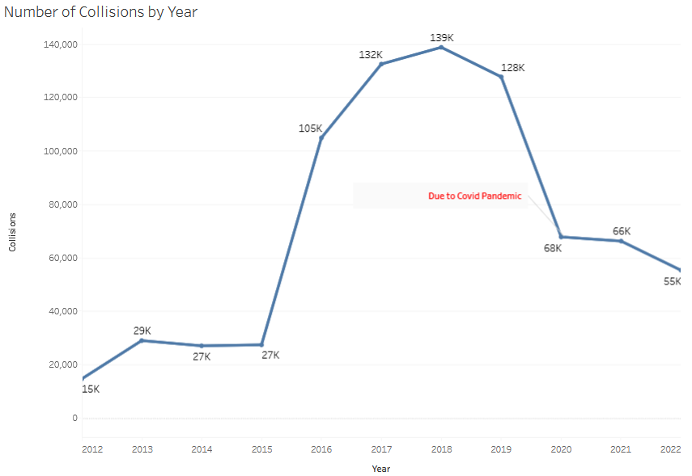

 

##### Insights

- We observed a significant decrease in collisions in 2020, which coincided with the onset of the COVID-19 pandemic. The pandemic measures possibly influenced traffic patterns in the city.
  
 

2. **Bar chart** showing number of collisions by hour. This KPI can show which time (24-hour clock) collisions are more likely to occur. The Metropolitan Transportation Authority can use this insight to increase public transportation during crash- prone hours to disincentivize driving.

 
   
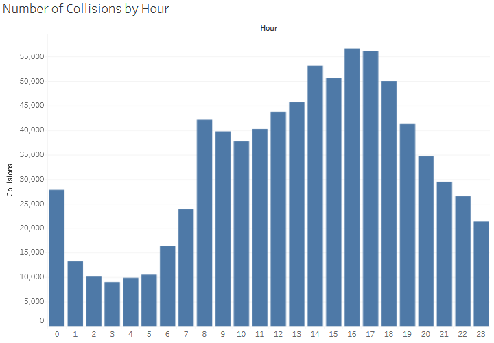 

 

##### Insights

-  Most collisions occur between 8 am and 6 pm, with the highest number happening at 5 and 6 pm.
  
 

3. **Bubble graph** showing the number of victims by month (by year). The size of each bubble correlates to the number of victims for that month. This can help the audience easily digest when most collisions take place and allow experts to better plan city traffic during months of high collisions.

 

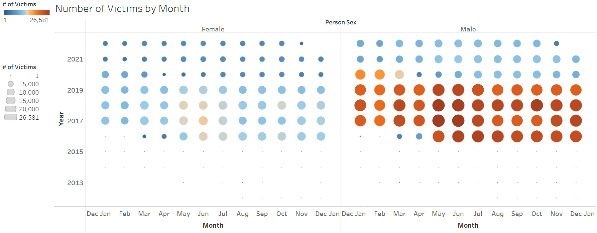 

 

##### Insights

- Regardless of the month, males have a higher likelihood of being involved in motor vehicle accidents than females.
  
 

4. **Histogram** showing number of victims by age. A histogram works well here because it breaks down the frequency of collisions by age group (bins). We also further separated the data to look a male v.s female statistics of the victims. Public safety officials can create educational campaigns targeting the age and gender groups more likely to experience a collision.
   
 
   
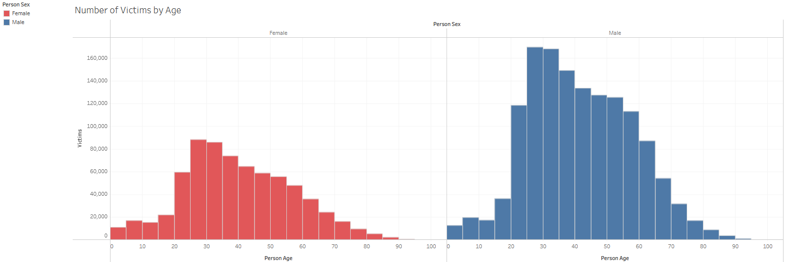

 

##### Insights

- Regardless of gender, individuals aged 25 to 35 are more likely to be involved in collisions
  
 

6. Another l**ine graph** showing number of cyclist collisions by year. We want to see how the introduction of city bikes since 2013 affected overall cyclist collisions (injuries and death).

 

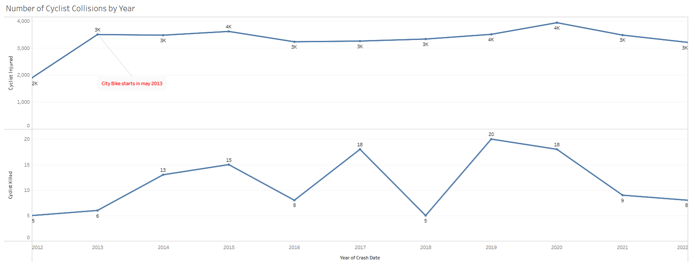

 

##### Insights

- We observed a significant increase in cyclist injuries in 2013, which coincided with the introduction of Citi Bike. This surge could be attributed to the growing popularity of bike-sharing programs, leading to a higher number of cyclists on the roads
  
 

6. **GeoMap** showing number of collisions by zip code. Because our visuals are made in Tableau (and later published as dashboard), users can easily hover over the map to see the breakdown of collision counts by zip code. 
    
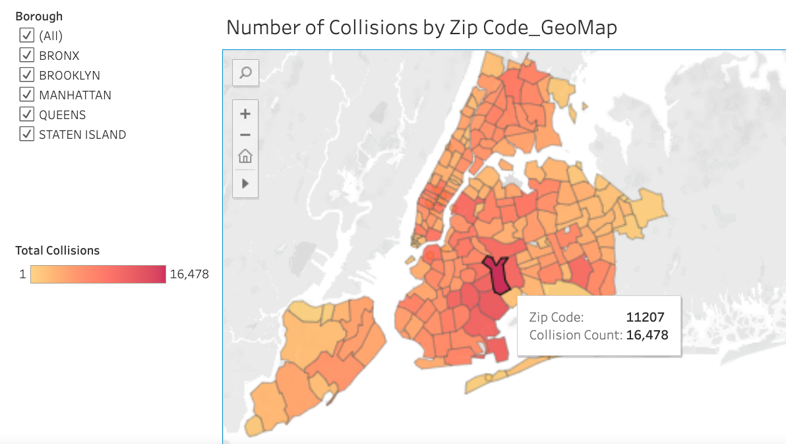

 

##### Insights

- The zip code 11207 has the highest total collisions, and neighboring zip codes exhibit similarly high numbers. This area, known as East New York, appears to be a notable hotspot for collisions.
  
 

We originally had a **treemap graph** here showing areas of high collision, but it pushed out and made smaller collision count zip codes harder to see since size of the treemap directly correlates to collision count.

 

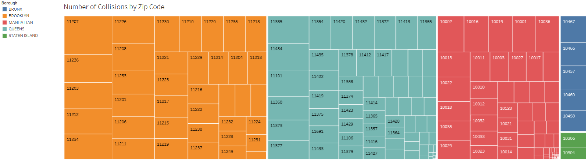

 

#### Dashboard 1

 

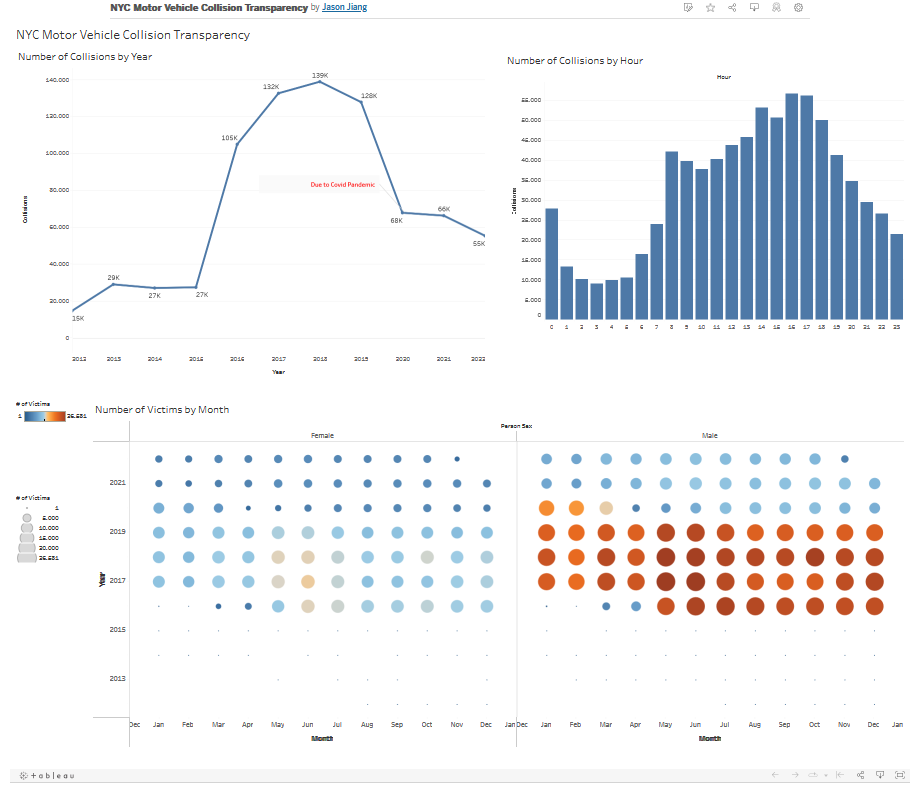

 

#### Dashboard 2

 

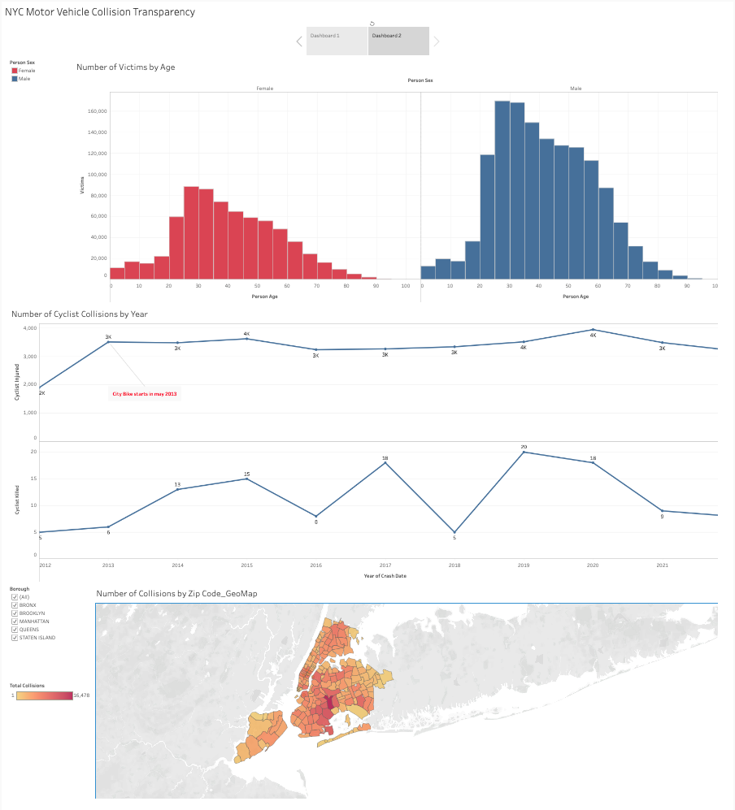

 

### 6.Deployment

The project was deployed on Tableau Public: [Chick this link to see our dashboards](https://public.tableau.com/app/profile/jason.jiang4864/viz/NYCMotorVehicleCollisionTransparency_Story/Story?publish=yes)

## Key insights :bulb:

### Lessons learned :sparkles:
